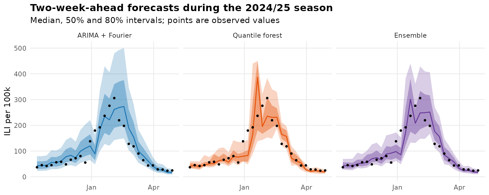
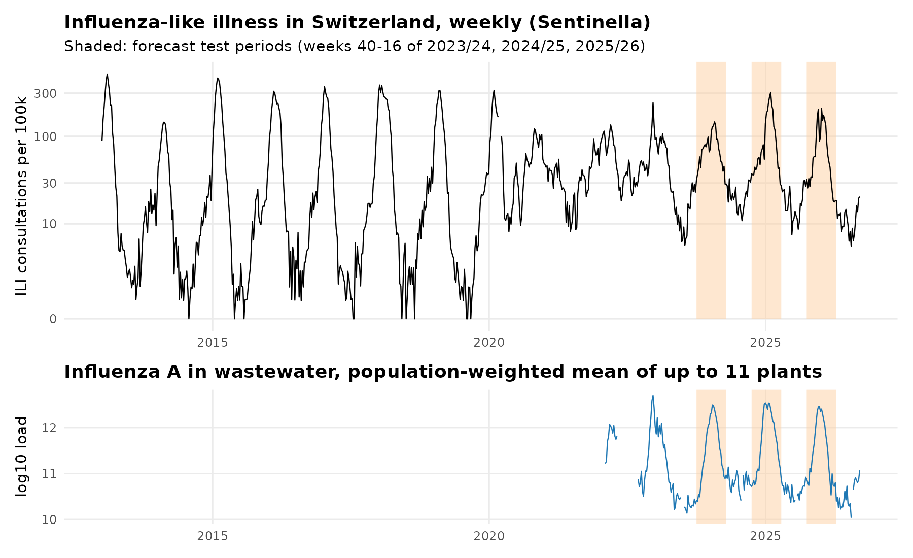
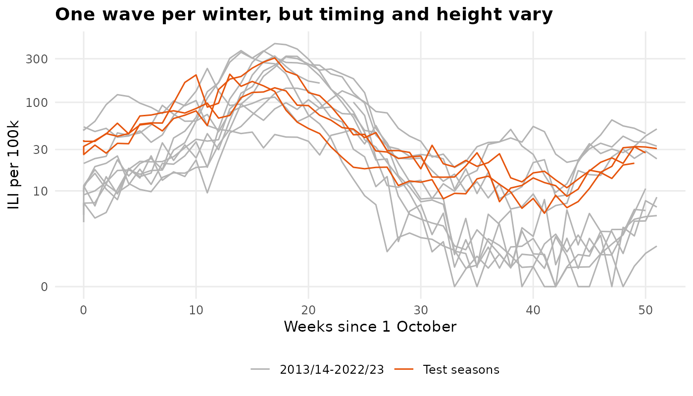
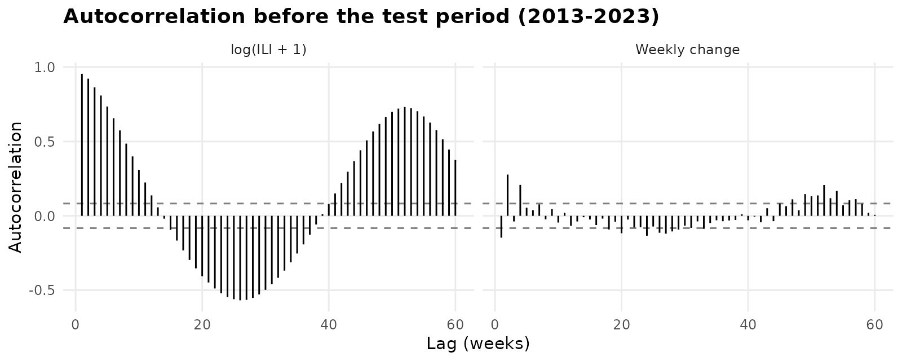
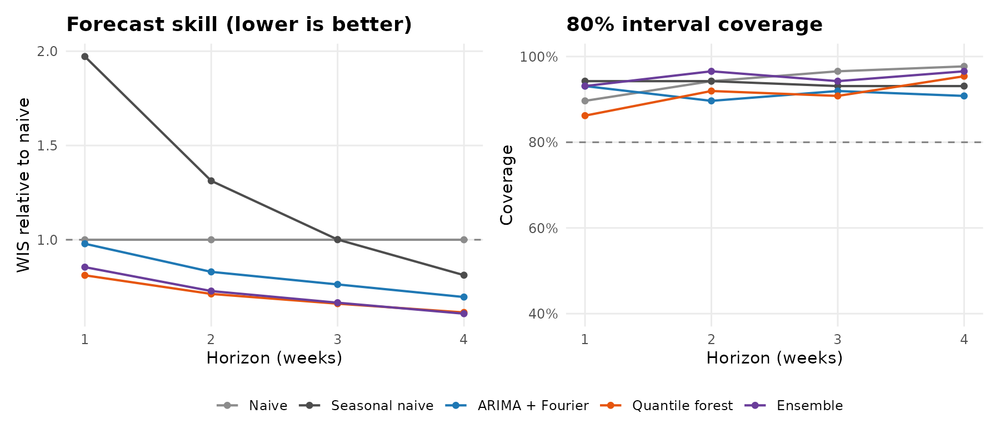
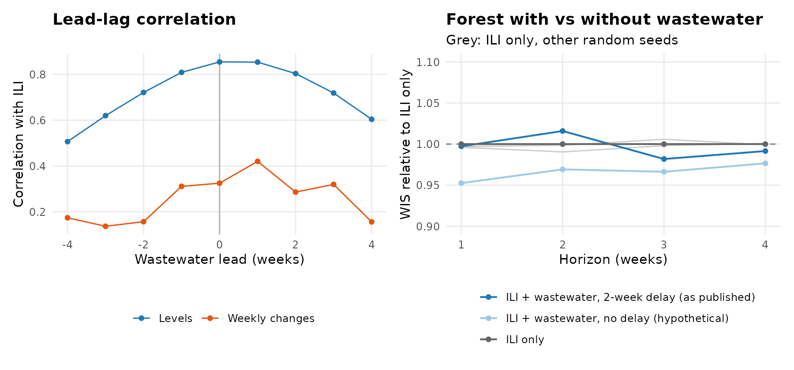

# Forecasting the Swiss flu wave: time-series models vs machine learning

**Probabilistic 1–4 week forecasts of influenza-like illness in Switzerland, evaluated out of sample over three winters, with a test of whether wastewater data add information**

Joe Martin · BSc Food Science & Technology, ETH Zurich · jomartin@ethz.ch



---

## Summary

- **Question.** How well can the national flu wave be forecast 1–4 weeks ahead from public surveillance data? Does a machine-learning model beat classical time-series models once all of them are tested the way they would be used in practice?
- **Data.**
  - Weekly consultations for influenza-like illness (ILI) per 100,000 inhabitants from the Sentinella GP network, January 2013 to September 2026 (716 weeks).
  - Influenza A viral load in wastewater from up to 11 treatment plants, from February 2022.
  - Both series come from the Federal Office of Public Health (BAG).
- **Set-up.**
  - Every model forecasts log(ILI + 1) as five quantiles, 1 to 4 weeks ahead.
  - Forecasts start at each of the 87 weeks in weeks 40–16 of the winters 2023/24, 2024/25 and 2025/26. Each time the model uses only data up to that week (rolling origin with an expanding window).
  - The models: naive, seasonal naive, ARIMA with Fourier terms, a quantile regression forest, and an ensemble of the last two.
  - Forecasts are scored with the weighted interval score (WIS) and interval coverage.
- **The forest was the best model.**
  - It was the best single model in each of the three winters (relative WIS 0.72, 0.61 and 0.71; ARIMA 0.88, 0.66 and 0.83).
  - Over all forecast dates its WIS was 19% below the naive forecast at 1 week and 39% below at 4 weeks (relative WIS 0.81, 0.71, 0.66, 0.61).
  - Its mean absolute error for the median forecast was 24.7 ILI consultations per 100k, against 32.9 for the naive forecast.
- **ARIMA with Fourier terms helped only beyond one week.**
  - At 1 week it was about as good as the naive forecast (relative WIS 0.98). At 4 weeks it was 30% better (0.70).
  - "Same week last year" was worse than the naive forecast at 1 and 2 weeks (1.97 and 1.31) and no better at 3 weeks. The timing of the wave varies too much from year to year.
- **The ensemble matched the forest.** Averaging the ARIMA and forest quantiles gave almost the same WIS overall (0.69 vs 0.68). It was the best of all models in 2024/25 (0.59).
- **Intervals were mostly too wide.** In the main comparison, the 80% intervals contained the observed value in 86–98% of forecasts. Forests trained only on data from 2022 (wastewater experiment) had the opposite problem: 67–83%.
- **Wastewater added little.**
  - Wastewater tracks ILI closely. Levels correlate at 0.85 in the same week and one week ahead. For weekly changes the correlation is highest at a 0–1 week lead (0.32–0.42).
  - Adding wastewater to the forest changed the WIS by −1.8% to +1.6%, using the 2-week publication delay the data actually have. None of these differences was significant.
  - With no delay, which is not possible in practice, the WIS was 2–5% lower (p < 0.05 at 2 and 3 weeks).
  - Refitting the forest with other random seeds moves its WIS by up to 1%. The training period (from 2022) is short.
- **Random cross-validation was slightly optimistic.** On the same test weeks, random 10-fold cross-validation gave an 8% lower error for the forest than the rolling-origin evaluation (log-scale MAE 0.226 vs 0.246). See Methods for why the gap is small here.
- **P-values are indicative only.** With three test seasons and overlapping horizons, the consistent ranking across seasons is stronger evidence than the Diebold–Mariano p-values. Those p-values are below 0.001 for the forest against the naive forecast at every horizon.

---

## Figures

| | |
|---|---|
|  |  |
| **1** ILI and wastewater series, test periods shaded | **2** Season overlay: one wave per winter, variable timing and height |
|  |  |
| **3** Autocorrelation of the level and of the weekly change | **5** Relative WIS and 80% coverage by horizon |
|  |  |
| **4** Two-week-ahead forecasts in 2024/25 | **6** Wastewater: lead-lag correlation and forecast value |

---

## Data

| Source | Series | Terms of use |
|---|---|---|
| Federal Office of Public Health (BAG), IDD export `INFLUENZA_sentinella`, published 23 September 2026 | Weekly ILI consultations per 100,000 inhabitants, Switzerland, all ages (Sentinella, extrapolated) | Free use with source attribution |
| BAG, IDD export `RESPVIRUSES_wastewater` (data: Eawag), published 23 September 2026 | Daily influenza A viral load per treatment plant (gene copies per day per 100,000 inhabitants) | Free use with source attribution |

Raw files and SHA-256 checksums: `results/input_manifest.csv`. Downloaded from `https://api.idd.bag.admin.ch/api/v1/export/latest/<file>/csv` on 26 September 2026.

---

## Methods

**Target.**
- The national weekly ILI incidence, transformed to y = log(ILI + 1).
- Why the log: epidemics grow multiplicatively, errors at the peak and in the trough become comparable, and back-transformed forecasts cannot be negative. The +1 handles weeks with zero consultations in pre-2020 summers.
- Two missing weeks (2020-W11/12, start of the COVID-19 pandemic) are interpolated on the log scale.
- Since 2020 the summer baseline has been much higher than before (Figure 1). ILI is a syndrome, not a lab-confirmed diagnosis, so it also contains other respiratory viruses.

**Wastewater index.**
- For each plant and ISO week, the mean daily influenza A load is computed.
- These are combined into a population-weighted mean over the plants that reported that week (at least 2 plants). Plants joined the programme over 2022–23, and the set of reporting plants can change from week to week, which adds some noise to the index.
- The index is log10(load + 10^10). The shift keeps values below the limit of quantification, which are often zero, finite.
- The BAG states a publication delay of at least 13 days for wastewater and 1 day for ILI. The forecast therefore uses the wastewater value from two weeks before the forecast date.

**Validation.**
- Rolling origin with an expanding window: 87 forecast dates in weeks 40–16 of 2023/24, 2024/25 and 2025/26.
- At every forecast date, all models are fitted only on data up to that week.
- Model settings chosen before the test period are not changed afterwards.

**Models.**
- **Naive:** the last observed value plus the empirical quantiles of past h-week changes in weeks 40–16. The median therefore includes the (slightly negative) median past change.
- **Seasonal naive:** the value from 52 weeks before the target week, plus the empirical quantiles of its past errors.
- **ARIMA + Fourier:** regression on K Fourier pairs (period 365.25/7 weeks) with ARIMA errors on y.
  - K and the ARIMA order were chosen once, by AICc on data before the first test week: K = 2, ARIMA(3,1,3) without drift (`results/arima_order_selection.csv`).
  - The coefficients are re-estimated at every forecast date. The quantiles come from the model's normal forecast distribution.
- **Quantile regression forest** (Meinshausen 2006; `ranger`, 2,000 trees, minimum node size 5, no tuning, fixed seeds).
  - One direct model per horizon. It predicts the change y(t+h) − y(t), so it is not limited to the range of levels seen in training.
  - Features: the current level; the changes over 1, 2 and 4 weeks; last year's value for the target week relative to now; the week of the target as sine and cosine.
  - Permutation importance of a forest fitted on all data up to the last forecast date (`results/forest_importance.csv`) is descriptive only, since the season features are correlated with each other. At 1 week, level and recent changes matter about as much as season. At 4 weeks, season timing and last year's value dominate.
- **Ensemble:** the mean of the ARIMA and forest quantiles (quantile averaging).

**Scoring.**
- The weighted interval score (Bracher et al. 2021) is computed from the median and the 50% and 80% intervals, on the log scale (Bosse et al. 2023). It rewards sharp intervals and penalises observations outside them. For the median alone it reduces to the absolute error.
- Relative WIS is the mean WIS of a model divided by the mean WIS of the naive forecast over the same forecast dates.
- Differences are tested with the Diebold–Mariano test with the Harvey et al. small-sample correction, using h − 1 autocovariances. The three test seasons are joined into one series. No correction is made for multiple testing.
- The MAE of the median is also reported on the original scale (ILI per 100k).

**Wastewater experiment.**
- Three forest variants are trained on exactly the same weeks (from 2022) and tested on the same 87 forecast dates: ILI features only; plus wastewater with a 2-week delay; plus wastewater without delay (hypothetical).
- Wastewater features: the index and its weekly change.
- To show how much the forest varies by chance, the ILI-only variant was refitted with two other random seeds.
- Lead-lag: the correlation of levels and of weekly changes, in weeks 40–16 from October 2022.

**Leakage check.**
- The 2-week forest is evaluated with random 10-fold cross-validation over all weeks. Its error on the 87 test weeks is compared with the rolling-origin error on the same weeks.
- With random folds, the model is trained on weeks after the week it predicts, including the rest of the same wave.
- Random cross-validation can be nearly unbiased for purely autoregressive models with uncorrelated errors (Bergmeir et al. 2018). Here that condition does not hold: 2-week-ahead targets overlap in time, and the features include season terms. The 8% gap should therefore be read as a lower bound for this set-up.
- The two schemes also differ in how much data the model sees: random folds train on 90% of all weeks, including later seasons. So the gap mixes leakage with training-set size.

---

## Limitations

- **Latest data, not real-time data.** The forecasts use the September 2026 version of the data. In real time, recent weeks may still have been revised (backfill), so these errors are somewhat optimistic.
- **Three test seasons.** 87 forecast dates, with overlapping horizons and gaps between seasons. The p-values should be read as indicative.
- **ILI is not specific to flu.** The target includes other respiratory infections, and the level changed after 2020. Lab-confirmed influenza cases depend strongly on testing behaviour and were not used as the target.
- **Week definitions.** Until 2024-W20, Sentinella weeks run Saturday to Friday; wastewater weeks are ISO weeks (Monday to Sunday). The two overlap by five days.
- **Calibration.** Most intervals were too wide in the main comparison, while forests trained on the short 2022+ period were too narrow. Recalibration, for example with quantiles based on recent errors, was not tried.
- **Pandemic years.** The flu-free 2020/21 winter and the higher ILI baseline after 2020 are part of every training window and are not down-weighted.
- **52-week lag.** Last year's value is taken 52 weeks back. This is one week off after years with 53 ISO weeks (2015, 2020).
- **National level only.** Regional or age-specific forecasts, and a pooled model across regions, are natural extensions.

---

## Reproducibility

```
├── R/00_functions.R           # helpers: ISO week dates, WIS, forest features
├── R/01_data.R                # national ILI series and wastewater index
├── R/02_explore.R             # figures 1-3, lead-lag table
├── R/03_forecast.R            # rolling-origin forecasts, wastewater variants, leakage check
├── R/04_evaluate.R            # scores, Diebold-Mariano tests, figures 4-6
├── R/run_all.R                # runs everything, writes checksums and session info
├── scripts/download_data.sh   # downloads the latest data from the BAG API
├── data/raw/                  # archived raw data (26 September 2026)
├── data/processed/            # weekly analysis data set
├── results/                   # forecasts and scores (CSV)
└── figures/
```

`Rscript R/run_all.R` from the repository root. It takes about 20 minutes on two cores. Packages: data.table, forecast, ranger, ggplot2, patchwork, zoo, scales.

---

## References

- Bergmeir C, Hyndman RJ, Koo B (2018). A note on the validity of cross-validation for evaluating autoregressive time series prediction. *Computational Statistics & Data Analysis* 120:70–83.
- Bosse NI, Abbott S, Cori A, et al. (2023). Scoring epidemiological forecasts on transformed scales. *PLoS Computational Biology* 19(8):e1011393.
- Bracher J, Ray EL, Gneiting T, Reich NG (2021). Evaluating epidemic forecasts in an interval format. *PLoS Computational Biology* 17(2):e1008618.
- Diebold FX, Mariano RS (1995). Comparing predictive accuracy. *Journal of Business & Economic Statistics* 13(3):253–263.
- Harvey D, Leybourne S, Newbold P (1997). Testing the equality of prediction mean squared errors. *International Journal of Forecasting* 13(2):281–291.
- Hyndman RJ, Athanasopoulos G (2021). *Forecasting: Principles and Practice*, 3rd ed. OTexts.
- Meinshausen N (2006). Quantile regression forests. *Journal of Machine Learning Research* 7:983–999.

---

## Authorship

Research question, analysis decisions and interpretation: Joe Martin. The code and text were drafted with the help of an AI assistant (Claude, Anthropic), then checked, revised and run by the author. All numbers come from the scripts in this repository.

## Licence

- **Code** (`R/`, `scripts/`): MIT, see `LICENSE`.
- **Figures, text and result tables:** CC BY 4.0.
- **Data** in `data/raw/`: © Federal Office of Public Health (BAG); wastewater data from Eawag. Redistributed unchanged, with attribution.
